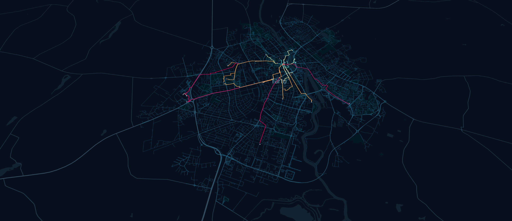

# Shortest path analysis in Tartu
From the Kissing Students to all fetched cafes with OSMnx

Web map: https://bryanvallejo16.github.io/shortest-walking-path-tartu/

Tutorial in Towards Data Science: https://towardsdatascience.com/shortest-path-algorithm-with-osm-walking-network-6d2863ae96be

### Shortest walking route to cafes

### Walking network fetched from OSM

